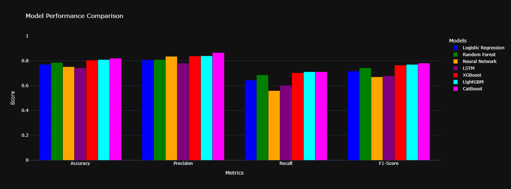

## Dependencies List for local machine/ virtual environments
pandas: For data manipulation and analysis

scikit-learn: For machine learning models and evaluation metrics

xgboost: For implementing XGBoost model

lightgbm: For implementing LightGBM model

catboost: For implementing CatBoost model

plotly: For interactive visualizations

tensorflow: For LSTM (Deep Learning) model

## Introduction

The Titanic dataset is a popular dataset used in machine learning, particularly for binary classification problems. It consists of data about passengers on the RMS Titanic and whether they survived or not. The task is to predict survival using various features such as age, sex, class, fare, and embarkation port. In this study, we compare the performance of multiple machine learning models: **Logistic Regression**, **Random Forest**, **Neural Networks**, **LSTM (Long Short-Term Memory)**, **XGBoost**, **LightGBM**, and **CatBoost**. We will discuss how each model works, its nature, and determine which model is best suited for this problem based on accuracy metrics.

## Models Overview

### 1. Logistic Regression
- **Nature**: Logistic Regression is a statistical model used for binary classification. It predicts the probability of the default class (in this case, survival) using a logistic function. It works well when the relationship between the input features and the output is linear.
- **Performance on Titanic Dataset**: With an accuracy of **77.10%**, Logistic Regression is a solid choice for linear problems but may underperform with more complex data due to its simplicity.

### 2. Random Forest
- **Nature**: Random Forest is an ensemble learning method based on decision trees. It combines multiple decision trees to improve classification accuracy by averaging their predictions. This reduces overfitting and improves model robustness.
- **Performance on Titanic Dataset**: Random Forest achieved an accuracy of **78.63%**. It performs better than Logistic Regression, especially when there are interactions between features and nonlinear relationships. The algorithm’s ability to handle missing data and its robustness makes it a reliable choice for the Titanic dataset.

### 3. Neural Network (NN)
- **Nature**: Neural networks, inspired by the human brain, consist of layers of interconnected neurons. They can model complex, nonlinear relationships between inputs and outputs. They require larger datasets to train effectively, as they have more parameters.
- **Performance on Titanic Dataset**: The Neural Network achieved an accuracy of **75.19%**, which is lower than both Random Forest and Logistic Regression. While Neural Networks can capture complex patterns, the limited size and structure of the Titanic dataset might hinder their performance. Furthermore, they can be more computationally expensive and harder to interpret.

### 4. Long Short-Term Memory (LSTM)
- **Nature**: LSTMs are a special type of recurrent neural network (RNN) designed to handle sequence-based data. LSTM’s ability to remember long-term dependencies in sequential data makes it a strong candidate for tasks like time-series prediction and natural language processing. However, for a tabular dataset like Titanic, LSTMs might be overkill.
- **Performance on Titanic Dataset**: With an accuracy of **74.43%**, LSTMs performed the worst in this comparison. While LSTMs are powerful for sequential data, they struggle with non-sequential problems like the Titanic dataset, where feature interactions are not time-dependent.

### 5. XGBoost
- **Nature**: XGBoost (Extreme Gradient Boosting) is an optimized gradient boosting algorithm that builds trees sequentially to reduce residual errors from the previous tree. It is highly effective for structured/tabular data and often achieves state-of-the-art results in machine learning competitions.
- **Performance on Titanic Dataset**: XGBoost achieved an accuracy of **80.53%**, outperforming the simpler models like Logistic Regression and Neural Networks. Its ability to handle interactions between features and its robustness to overfitting make it one of the top choices for tabular data like the Titanic dataset.

### 6. LightGBM
- **Nature**: LightGBM (Light Gradient Boosting Machine) is another gradient boosting framework. It is faster and more efficient than XGBoost, especially with large datasets. It uses histogram-based learning to speed up training and supports categorical features without needing one-hot encoding.
- **Performance on Titanic Dataset**: LightGBM achieved an accuracy of **80.92%**, making it one of the best performers in this comparison. It is particularly well-suited for large datasets and performs well on a wide variety of machine learning tasks, including classification problems like the Titanic dataset.

### 7. CatBoost
- **Nature**: CatBoost is a gradient boosting algorithm that handles categorical features directly without the need for preprocessing, such as one-hot encoding. It also reduces overfitting through regularization techniques. CatBoost is known for its speed, accuracy, and ease of use.
- **Performance on Titanic Dataset**: CatBoost achieved the highest accuracy of **82.06%** among all models. Its superior performance stems from its ability to deal with categorical features efficiently, making it highly suited for datasets like Titanic where categorical features like `sex`, `embarked`, and `pclass` play a significant role in determining survival.

## Comparison of Model Performance

| **Model**           | **Accuracy** |
|---------------------|--------------|
| Logistic Regression | 77.10%       |
| Random Forest       | 78.63%       |
| Neural Network      | 75.19%       |
| LSTM                | 74.43%       |
| XGBoost             | 80.53%       |
| LightGBM            | 80.92%       |
| CatBoost            | 82.06%       |

## Conclusion

After evaluating all the models on the Titanic dataset, **CatBoost** emerges as the best-performing model with an accuracy of **82.06%**. This is due to its ability to handle categorical data efficiently and its overall robustness. **LightGBM** and **XGBoost** also performed exceptionally well, with accuracies of **80.92%** and **80.53%**, respectively. These gradient boosting methods are highly effective for tabular datasets, especially when handling interactions and non-linear relationships.

On the other hand, **Logistic Regression** and **Random Forest** are simpler models that provide a good baseline with accuracies of **77.10%** and **78.63%**, respectively. They are easier to interpret and train, but they fail to outperform the more complex models.

Lastly, **Neural Networks** and **LSTMs** performed suboptimally on the Titanic dataset, as they are designed for more complex problems like image recognition or sequential data analysis. These models showed accuracies of **75.19%** and **74.43%**, which are lower than the gradient boosting models and traditional classifiers.

In conclusion, **CatBoost** stands out as the best model for predicting Titanic survival, but **LightGBM** and **XGBoost** are also excellent choices. These models are well-suited for tabular data and outperform traditional models like Logistic Regression and Neural Networks in terms of accuracy on this dataset.
